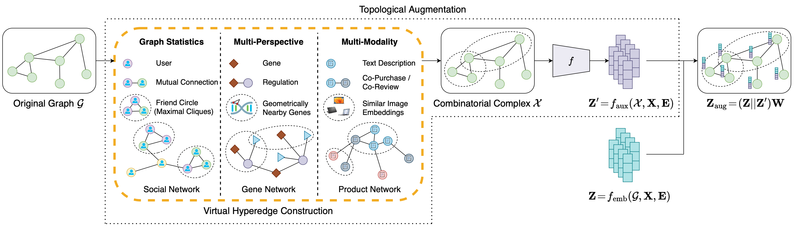

# Enhancing Node Representations for Real-World Complex Networks with Topological Augmentation

*27th European Conference on Artificial Intelligence (ECAI 2024)*

[Paper](https://arxiv.org/abs/2402.13033)

## Abstract

Graph augmentation methods play a crucial role in improving the performance and enhancing generalisation capabilities in Graph Neural Networks (GNNs). Existing graph augmentation methods mainly perturb the graph structures, and are usually limited to pairwise node relations. These methods cannot fully address the complexities of real-world large-scale networks, which often involve higher-order node relations beyond only being pairwise. Meanwhile, real-world graph datasets are predominantly modelled as simple graphs, due to the scarcity of data that can be used to form higher-order edges. Therefore, reconfiguring the higher-order edges as an integration into graph augmentation strategies lights up a promising research path to address the aforementioned issues. In this paper, we present *Topological Augmentation (TopoAug)*, a novel graph augmentation method that builds a combinatorial complex from the original graph by constructing virtual hyperedges directly from the raw data. TopoAug then produces auxiliary node features by extracting information from the combinatorial complex, which are used for enhancing GNN performances on downstream tasks. We design three diverse virtual hyperedge construction strategies to accompany the construction of combinatorial complexes: (1) via graph statistics, (2) from multiple data perspectives, and (3) utilising multi-modality. Furthermore, to facilitate TopoAug evaluation, we provide 23 novel real-world graph datasets across various domains including social media, biology, and e-commerce. Our empirical study shows that TopoAug consistently and significantly outperforms GNN baselines and other graph augmentation methods, across a variety of application contexts, which clearly indicates that it can effectively incorporate higher-order node relations into the graph augmentation for real-world complex networks. %Specifically, on the Amazon datasets, our method surpasses the GCN baseline by 37.0% on average, outperforms GAT by 30.8% on average, and exceeds GraphSAGE by 33.8% on average.



## How to run

### Dependencies

The following Python libraries are required to run the code:

* PyTorch
* PyTorch Geometric
* PyYAML

### Training

To train a model, simply run the following command:

    python main.py [model]

You can also perform multi-process training with the following command:

    python main_multi_process.py [model]

You can modify the set of datasets and augmentations you wish to use for training in `main.py` and `main_multi_process.py`.
    
## Cite this project

```bibtex
@inproceedings{Zhao2024TopoAug,
    title = {Enhancing Node Representations for Real-World Complex Networks with Topological Augmentation},
    author = {Xiangyu Zhao and 
              Zehui Li and 
              Mingzhu Shen and
              Guy-Bart Stan and
              Pietro Li{\`o} and
              Yiren Zhao},
    booktitle = {27th European Conference on Artificial Intelligence (ECAI 2024)},
    series = {Frontiers in Artificial Intelligence and Applications},
    publisher = {IOS Press},
    year = {2024}
}
```
